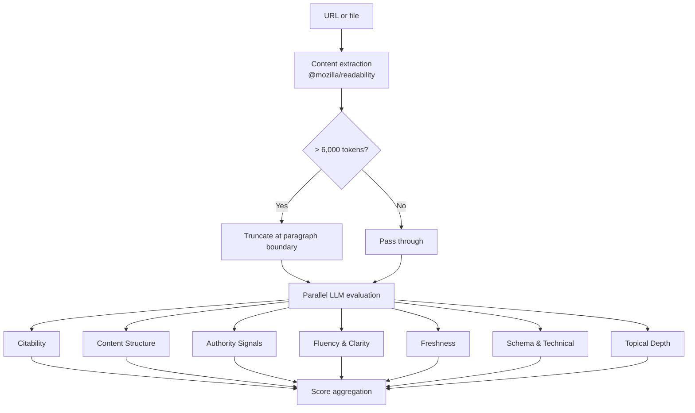

<div align="center">

# 🪨 geode

**Open-source GEO (Generative Engine Optimization) scorer.**

Analyze your content for AI search visibility. Get actionable suggestions. Bring your own API key.

[](LICENSE)
[](https://nodejs.org)

</div>

---

AI search engines like ChatGPT, Perplexity, Gemini, and Google AI Overviews are replacing traditional search. Your content needs to be optimized for **citation**, not just ranking.

geode scores your content across research-backed GEO categories and tells you exactly what to fix — using your own LLM to evaluate, so scoring evolves as models improve.

```
────────────────────────────────────────────────────────────────────────
  geode — GEO Score Report
  https://web.dev/articles/vitals
────────────────────────────────────────────────────────────────────────

  Overall Score: 6.4 / 10

  Citability             ████████░░  8.0
  Content Structure      ███████░░░  7.0
  Authority Signals      ████░░░░░░  4.0
  Fluency Clarity        ████████░░  8.0
  Freshness              ██░░░░░░░░  2.0
  Schema Technical       ████████░░  8.0
  Topical Depth          ████████░░  8.0

────────────────────────────────────────────────────────────────────────
  Action Items
────────────────────────────────────────────────────────────────────────

  HIGH  Update the publish date to reflect recent revisions
        → Published: May 4, 2020

  HIGH  Include a named author with credentials or a bio
        → Published: May 4, 2020

  HIGH  Add citations and links to studies supporting claims
        → Overview

  MED   Add a dedicated FAQ section with common questions
        → After the 'Changes to Web Vitals' section

────────────────────────────────────────────────────────────────────────
  7 categories scored in 3.8s · openai/gpt-4o
```

## Why geode?

| | Commercial GEO tools | geode |
|---|---|---|
| **Pricing** | $49-299/mo subscription | Free forever |
| **Scoring engine** | Static rules that go stale | Your LLM — evolves as models improve |
| **Data privacy** | Your content hits their servers | BYOK — content goes to your own API |
| **Extensibility** | Closed | Open source, modular, hackable |

## Quick Start

```bash
# Clone and install
git clone https://github.com/AnshulDesai/geode.git
cd geode
npm install && npm run build && npm link

# Set your API key
export OPENAI_API_KEY="sk-..."

# Score any URL
geode score https://your-blog.com/article
```

## Usage

```bash
# Score a URL
geode score https://example.com/blog/my-article

# Score a local file (Markdown, HTML, or plain text)
geode score ./my-post.md

# JSON output to stdout
geode score https://example.com --json

# Terminal scorecard + JSON file
geode score https://example.com --both

# Use Anthropic
export ANTHROPIC_API_KEY="sk-ant-..."
geode score https://example.com --provider anthropic --model claude-sonnet-4-20250514

# Use AWS Bedrock (uses ~/.aws/credentials)
geode score https://example.com --provider bedrock --model us.anthropic.claude-sonnet-4-6 --region us-east-1

# Use a cheaper model
geode score https://example.com --model gpt-4o-mini

# Average over multiple runs for stability
geode score https://example.com --runs 3

# Debug output
geode score https://example.com --verbose

# Launch the web UI (inspector mode)
geode serve
# Then open http://localhost:3000
```

### CLI Reference

```
geode score <target> [options]

Arguments:
  target                    URL (http/https) or file path

Options:
  --json                    Output JSON to stdout
  --both                    Terminal + JSON to ./geode-report.json
  --runs <n>                Average over N runs (default: 1)
  --model <name>            Override model (e.g. gpt-4o-mini)
  --provider <name>         openai | anthropic | bedrock
  --region <name>           AWS region for Bedrock (default: us-east-1)
  --config <path>           Path to .geoderc
  --verbose                 Debug output
  -h, --help                Show help
  -V, --version             Show version

Exit codes:
  0  All categories scored
  1  Fatal error
  2  Partial results (some categories failed)
```

```
geode serve [options]

Options:
  --port <n>                Port number (default: 3000)
  --model <name>            Override model
  --provider <name>         openai | anthropic | bedrock
  --region <name>           AWS region for Bedrock (default: us-east-1)
```

## Web UI

Run `geode serve` to launch the inspector — a split-panel interface with your score report on the left and a live page preview on the right.

- Click action items to scroll and highlight the relevant section on the page
- Configure provider, model, and API keys in Settings (⚙)
- Analysis history persists across sessions (stored in your browser)
- Supports multi-run averaging (1×, 3×, 5×) for stable scores

All processing happens locally — your API keys never leave your machine.

## Scoring Categories

geode evaluates content across 7 categories, based on research from the [GEO paper (KDD 2024)](https://arxiv.org/pdf/2311.09735), [First Page Sage's algorithm study](https://firstpagesage.com/seo-blog/generative-engine-optimization-geo-explanation/) (11,128 queries across ChatGPT, Gemini, Perplexity, Claude), and current GEO best practices.

| Category | What It Measures | Key Signals |
|----------|-----------------|-------------|
| **Citability** | Can AI extract and quote your content? | Self-contained paragraphs <80 words, statistics with attribution, quotable claims |
| **Content Structure** | Can AI parse and navigate it? | Answer-first formatting, heading hierarchy, FAQs, lists |
| **Authority Signals** | Does it look trustworthy? | Author credentials, cited sources, E-E-A-T signals |
| **Fluency & Clarity** | Is it readable and skimmable? | Concise sentences, natural language, consistent tone |
| **Freshness** | Is it current? | Recent publish/update dates, current data, no stale references |
| **Schema & Technical** | Is it machine-readable? | Structured data, semantic HTML, meta tags, crawl accessibility |
| **Topical Depth** | Does it fully cover the topic? | Subtopics addressed, entities mentioned, comprehensive coverage |

Each category is scored 1-10 by your LLM. The overall score is the unweighted mean.

The Schema & Technical category evaluates raw HTML (not just extracted text), so it can detect JSON-LD, meta tags, semantic markup, and structured data.

## Configuration

Create `.geoderc` in your project or home directory:

```yaml
provider: openai
model: gpt-4o
api_key_env: OPENAI_API_KEY
output: terminal  # terminal | json | both
```

**Resolution order:** CLI flags → env vars → `./.geoderc` → `~/.geoderc` → defaults

## How It Works



All 7 LLM calls run concurrently. If rate-limited, geode falls back to sequential with exponential backoff.

## Cost Per Run

| Model | Cost per article |
|-------|-----------------|
| gpt-4o-mini | ~$0.01 |
| claude-haiku | ~$0.02 |
| gpt-4o | ~$0.10 |
| claude-sonnet | ~$0.10 |

Cost scales linearly with article length. Use `gpt-4o-mini` or `claude-haiku` for budget-friendly scoring.

## Supported Inputs

| Input | Detection | Notes |
|-------|-----------|-------|
| URL | `http://` or `https://` prefix | Static HTML only. JS-rendered SPAs may return empty content. |
| HTML file | `.html` / `.htm` extension | Extracted via Readability |
| Markdown | `.md` extension | Passed as-is to LLM |
| Plain text | Everything else | Scored as-is |

**Tip:** If a URL returns empty results (JS-rendered site), save the page locally and pass the file instead.

## Roadmap

- [x] CLI scorer with 4 categories
- [x] OpenAI + Anthropic support
- [x] JSON output mode
- [x] Freshness, Schema & Technical, Topical Depth categories
- [x] Web UI with page inspector (`geode serve`)
- [ ] Custom category weights in `.geoderc`
- [ ] `--lite` mode (single prompt, ~5x cheaper)
- [ ] Batch mode (`--batch urls.txt`)
- [ ] CI/CD integration (GitHub Action, pre-commit hook)
- [ ] Historical score tracking
- [ ] Plugin API for community analyzers

## Contributing

Contributions welcome! geode is built with TypeScript and uses a modular architecture — each scoring category is a simple config object:

```typescript
{
  name: 'Citability',
  key: 'citability',
  description: 'how easily an AI system could extract and quote this content',
  criteria: `- Self-contained paragraphs under 80 words...`
}
```

Adding a new category is just adding a config to `src/analyzers/index.ts`.

## License

[MIT](LICENSE) — free forever.
